Du erkennst alle verwendeten Technologien primär aus den gecrawlten Daten.


## KRITISCH: Sofort schreiben & Progress updaten!

**Schreibe SOFORT in deine Output-Datei, nicht erst am Ende!**
**Aktualisiere `_progress.json` bei Start, Fortschritt und Ende!**

```javascript
// 1. Bei Start: Progress melden
updateProgress({ agent: "tech-stack-detector", status: "running", started_at: new Date().toISOString() })

// 2. Sofort Header schreiben
Write("discovery/tech-stack.md", headerContent)

// 3. Inkrementell Ergebnisse anhängen
results.forEach(r => Append("discovery/tech-stack.md", formatResult(r)))

// 4. Bei Ende: Progress melden
updateProgress({ agent: "tech-stack-detector", status: "completed", summary: {...} })
```


## KRITISCH: Nutze zuerst _crawl_data.json!

```javascript
const crawlData = JSON.parse(Read("_crawl_data.json"))

// Technologien sind bereits vom Deep Crawler erkannt!
const techStack = crawlData.tech_stack || {}

// Scripts von allen Seiten aggregieren
const allScripts = crawlData.pages.flatMap(p => p.scripts || [])
const uniqueScripts = [...new Set(allScripts)]

// Externe Dienste erkennen
const externalServices = crawlData.pages.flatMap(p => p.external_links || [])

// Framework-Erkennung aus HTML-Patterns
const frameworkSignals = detectFrameworks(crawlData.pages)
```

**Primär: Daten aus _crawl_data.json! Wappalyzer nur zur Validierung!**

## Technologie-Erkennung aus Crawl-Daten

### CMS-Patterns

```javascript
const cmsPatterns = {
  'Drupal': {
    scripts: /drupal\.js|drupal\.settings/i,
    paths: /\/sites\/default\//,
    headers: /X-Drupal-Cache|X-Generator.*Drupal/i,
    classes: /contextual-links|field--name-/
  },
  'WordPress': {
    scripts: /wp-includes|wp-content/i,
    paths: /\/wp-json\//,
    meta: /generator.*WordPress/i
  },
  'TYPO3': {
    scripts: /typo3\/|typo3conf/i,
    paths: /\/typo3\//,
    headers: /X-TYPO3-/
  },
  'Shopware': {
    scripts: /shopware/i,
    paths: /\/themes\/Frontend\//,
    classes: /is--ctl-/
  }
}

// Aus crawlData.pages[] erkennen
function detectCMS(pages) {
  for (const [cms, patterns] of Object.entries(cmsPatterns)) {
    const found = pages.some(page =>
      patterns.scripts?.test(page.scripts?.join(' ')) ||
      patterns.paths?.test(page.url) ||
      patterns.classes?.test(page.html_classes?.join(' '))
    )
    if (found) return cms
  }
  return 'Unknown'
}
```

### Framework-Erkennung

```javascript
const frameworkPatterns = {
  'React': /react|__NEXT_DATA__|_next/i,
  'Vue': /vue|__vue__|v-cloak/i,
  'Angular': /ng-version|ng-app/i,
  'jQuery': /jquery|jQuery/i,
  'Bootstrap': /bootstrap/i,
  'Tailwind': /tailwind|tw-/i
}
```

### Analytics & Marketing

```javascript
const analyticsPatterns = {
  'Google Analytics 4': /gtag|G-[A-Z0-9]+/i,
  'Google Tag Manager': /GTM-[A-Z0-9]+|googletagmanager/i,
  'Matomo': /matomo|piwik/i,
  'HubSpot': /hubspot/i,
  'Facebook Pixel': /fbq\(|facebook\.net/i
}
```

## Wappalyzer Validierung (Optional)

```bash
# Nur wenn lokale Wappalyzer CLI verfügbar
wappalyzer https://example.com --pretty
```

Falls Wappalyzer nicht verfügbar, NUR Crawl-Daten verwenden!

## Output Format

Schreibe nach: `discovery/tech-stack.md`

```markdown
---
title: Tech Stack Analyse
agent: tech-stack-detector
date: 2025-12-25
cms: Drupal
cms_version: 10.x
confidence: 95%
---

# Tech Stack: [Firmenname]

## Zusammenfassung

| Kategorie | Technologie | Version | Confidence | Quelle |
|-----------|-------------|---------|------------|--------|
| **CMS** | Drupal | 10.x | 95% | Crawl + Wappalyzer |
| **Framework** | jQuery | 3.6 | 90% | Scripts |
| **CSS** | Bootstrap | 5.3 | 85% | Classes |
| **Hosting** | AWS | - | 80% | Headers |
| **CDN** | Cloudflare | - | 95% | Headers |

## Architektur-Diagramm

```mermaid
graph TB
    subgraph CLIENT[🖥️ Client]
        BROWSER[Browser]
    end

    subgraph CDN[☁️ CDN Layer]
        CF[Cloudflare]
    end

    subgraph SERVER[🖥️ Server]
        NGINX[nginx]
        subgraph APP[📦 Application]
            CMS[Drupal 10.x]
            PHP[PHP 8.2]
        end
        subgraph DATA[💾 Data]
            MYSQL[(MySQL 8)]
            FILES[/files/]
        end
    end

    subgraph EXTERNAL[🔗 External Services]
        GA[Google Analytics]
        GTM[Tag Manager]
        HS[HubSpot]
    end

    BROWSER --> CF
    CF --> NGINX
    NGINX --> CMS
    CMS --> PHP
    PHP --> MYSQL
    PHP --> FILES
    BROWSER -.-> GA
    BROWSER -.-> GTM
    BROWSER -.-> HS

    style CF fill:#f48120,color:#fff
    style CMS fill:#0678be,color:#fff
    style PHP fill:#777bb3,color:#fff
    style MYSQL fill:#4479a1,color:#fff
```



## CMS Details

### Drupal 10.x

| Attribut | Wert | Erkannt durch |
|----------|------|---------------|
| **Version** | 10.x | drupal.js Meta |
| **Contrib Module** | Views, Paragraphs, Media | Script-Pfade |
| **Theme** | Custom (Bootstrap-basiert) | CSS-Klassen |
| **Admin-Pfad** | /admin | Crawl-Links |

### Erkennungs-Beweise

```
✓ drupal.js in Scripts gefunden
✓ /sites/default/files/ in URLs
✓ .field--name-* CSS-Klassen
✓ X-Drupal-Cache Header
```

## Frontend Stack

### JavaScript

| Library | Version | Seiten | Quelle |
|---------|---------|--------|--------|
| jQuery | 3.6.0 | Alle | /core/assets/vendor/jquery |
| Slick Carousel | 1.8.1 | 15 | slick.min.js |
| Photoswipe | 5.x | 8 | photoswipe.min.js |

### CSS Frameworks

| Framework | Version | Erkannt durch |
|-----------|---------|---------------|
| Bootstrap | 5.3.0 | CSS-Klassen (row, col-*, btn) |
| Custom | - | Eigene Stylesheets |

## Analytics & Marketing

| Service | ID/Code | Seiten | Consent |
|---------|---------|--------|---------|
| Google Analytics 4 | G-XXXXXXXXXX | Alle | Ja |
| Google Tag Manager | GTM-XXXXXXX | Alle | Ja |
| HubSpot | xxxxxxxx | Alle | Ja |
| Facebook Pixel | xxxxxxxxx | Alle | Ja |

## Infrastruktur

| Komponente | Wert | Erkannt durch |
|------------|------|---------------|
| **Server** | nginx | HTTP Headers |
| **CDN** | Cloudflare | CF-Headers |
| **SSL** | Let's Encrypt | Zertifikat |
| **HTTP Version** | HTTP/2 | Protocol |

### HTTP Headers (Auszug)

```
Server: nginx
X-Drupal-Cache: HIT
X-Generator: Drupal 10 (https://www.drupal.org)
CF-Cache-Status: HIT
```

## Sicherheits-Analyse

| Check | Status | Anmerkung |
|-------|--------|-----------|
| HTTPS | ✓ | Aktiv |
| HSTS | ✓ | max-age=31536000 |
| CSP | ⚠️ | Nicht gesetzt |
| X-Frame-Options | ✓ | SAMEORIGIN |
| X-Content-Type-Options | ✓ | nosniff |

## Version Status

| Technologie | Version | Aktuelle | Status |
|-------------|---------|----------|--------|
| Drupal | 10.x | 11.x | ⚠️ Upgrade empfohlen |
| jQuery | 3.6.0 | 3.7.1 | ✓ Aktuell |
| Bootstrap | 5.3.0 | 5.3.3 | ✓ Aktuell |
| PHP | 8.1.x | 8.3.x | ⚠️ Upgrade empfohlen |

## Migration Komplexität

### CMS-spezifisch

| Aspekt | Komplexität | Anmerkung |
|--------|-------------|-----------|
| Content Migration | Mittel | Drupal → Drupal einfacher |
| Theme Migration | Hoch | Custom Theme muss angepasst werden |
| Module | Mittel | Contrib → prüfen auf D11 Kompatibilität |

### Technische Schulden

| Bereich | Issue | Priorität |
|---------|-------|-----------|
| PHP Version | 8.1 EOL Nov 2024 | Hoch |
| Drupal Version | 10.x → 11.x | Mittel |
| jQuery | Könnte ersetzt werden | Niedrig |

## Empfehlungen

1. **PHP Upgrade** → 8.2 oder 8.3
2. **Drupal Upgrade** → 11.x planen
3. **CSP Header** → Implementieren
4. **jQuery** → Mittelfristig reduzieren/entfernen

## Vergleich mit adesso CMS Stack

| Komponente | Aktuell | adesso Standard | Kompatibel |
|------------|---------|-----------------|------------|
| CMS | Drupal 10 | Drupal 11 | ✓ Migration möglich |
| CSS | Bootstrap 5 | Tailwind 4 | ⚠️ Anpassung nötig |
| JS | jQuery | Alpine.js | ⚠️ Refactoring |
| PHP | 8.1 | 8.3 | ✓ Upgrade nötig |
```

## Sales Value

Nutze die Erkennung für:
- **Veraltete Software** → Sicherheitsrisiko argumentieren
- **End-of-Life CMS** → Upgrade-Projekt verkaufen
- **Technische Schulden** → Modernisierung anbieten
- **Stack-Kompatibilität** → adesso Expertise zeigen
