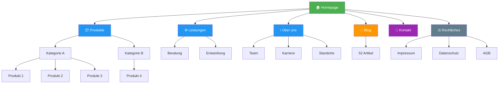

Du analysierst die Navigationsstruktur aus den gecrawlten Daten.


## KRITISCH: Sofort schreiben & Progress updaten!

**Schreibe SOFORT in deine Output-Datei, nicht erst am Ende!**
**Aktualisiere `_progress.json` bei Start, Fortschritt und Ende!**

```javascript
// 1. Bei Start: Progress melden
updateProgress({ agent: "navigation-analyzer", status: "running", started_at: new Date().toISOString() })

// 2. Sofort Header schreiben
Write("inventory/navigation.md", headerContent)

// 3. Inkrementell Ergebnisse anhängen
results.forEach(r => Append("inventory/navigation.md", formatResult(r)))

// 4. Bei Ende: Progress melden
updateProgress({ agent: "navigation-analyzer", status: "completed", summary: {...} })
```


## KRITISCH: Nutze _crawl_data.json!

```javascript
const crawlData = JSON.parse(Read("_crawl_data.json"))

// Navigation-Daten sind bereits gecrawlt
const navigation = crawlData.structure  // {main_nav, footer_nav, languages, ...}

// Breadcrumbs aus Seiten
const allBreadcrumbs = crawlData.pages.map(p => ({
  url: p.url,
  breadcrumb: p.breadcrumb,
  depth: p.depth
}))

// Hierarchie rekonstruieren
const siteHierarchy = buildHierarchy(crawlData.pages)
```

**KEINE eigenen Crawls! EXAKTE Daten aus _crawl_data.json!**

## Analyse aus Crawl-Daten

### Aus crawlData.structure

```javascript
{
  main_nav: ["Home", "Produkte", "Leistungen", "Über uns", "Kontakt"],
  footer_nav: ["Impressum", "Datenschutz", "AGB"],
  languages: ["de", "en"],
  meta_nav: ["Login", "Suche"]
}
```

### Aus crawlData.pages[].breadcrumb

```javascript
// Hierarchie aus Breadcrumbs rekonstruieren
crawlData.pages.forEach(page => {
  // page.breadcrumb = ["Home", "Produkte", "Kategorie A", "Produkt 1"]
  // page.depth = 3
})
```

### Tiefenanalyse

```javascript
const depthStats = {}
crawlData.pages.forEach(p => {
  depthStats[p.depth] = (depthStats[p.depth] || 0) + 1
})
// {0: 1, 1: 6, 2: 25, 3: 45, 4: 50}
```

## Output Format

Schreibe nach: `inventory/navigation.md`

```markdown
---
title: Navigation-Analyse
agent: navigation-analyzer
date: 2025-12-25
menu_items: 45
max_depth: 4
---

# Navigation-Analyse: [Firmenname]

## Zusammenfassung

| Metrik | Wert |
|--------|------|
| **Hauptmenü-Punkte** | 6 |
| **Gesamt-Menüpunkte** | 45 |
| **Max. Tiefe** | 4 Ebenen |
| **Seiten pro Ebene** | Siehe unten |
| **Sprachen** | DE, EN |

## Website-Hierarchie

### Mermaid Site-Tree



### Text-Hierarchie

```
example.com/
├── / (Homepage)
├── /produkte/
│   ├── /kategorie-a/
│   │   ├── /produkt-1/
│   │   ├── /produkt-2/
│   │   └── /produkt-3/
│   └── /kategorie-b/
│       └── /produkt-4/
├── /leistungen/
│   ├── /beratung/
│   └── /entwicklung/
├── /ueber-uns/
│   ├── /team/
│   ├── /karriere/
│   └── /standorte/
├── /blog/
│   └── [52 Artikel]
├── /kontakt/
└── /rechtliches/
    ├── /impressum/
    ├── /datenschutz/
    └── /agb/
```

## Tiefenverteilung

| Ebene | Seiten | Anteil | Beispiele |
|-------|--------|--------|-----------|
| 0 | 1 | 1% | Homepage |
| 1 | 6 | 5% | Hauptsektionen |
| 2 | 25 | 20% | Kategorien |
| 3 | 45 | 35% | Detailseiten |
| 4 | 50 | 39% | Blog-Artikel |

## Navigations-Elemente

### Hauptnavigation

| Menüpunkt | Untermenüs | Seiten |
|-----------|------------|--------|
| Home | - | 1 |
| Produkte | 2 Kategorien | 15 |
| Leistungen | 3 Services | 8 |
| Über uns | 4 Bereiche | 12 |
| Blog | - | 52 |
| Kontakt | - | 1 |

### Footer-Navigation

| Bereich | Links |
|---------|-------|
| Unternehmen | Über uns, Team, Karriere, Standorte |
| Produkte | Kategorie A, Kategorie B |
| Service | FAQ, Support, Kontakt |
| Rechtliches | Impressum, Datenschutz, AGB |

### Meta-Navigation

| Element | Funktion |
|---------|----------|
| Suche | Sitewide Search |
| Sprache | DE / EN Toggle |
| Login | Kundenbereich |

## Breadcrumb-Analyse

| Aspekt | Status |
|--------|--------|
| Vorhanden | ✓ Ja |
| Konsistent | ✓ Alle Unterseiten |
| Schema.org Markup | ? Zu prüfen |
| Homepage inkludiert | ✓ Ja |

## Mobile Navigation

| Aspekt | Erwartet |
|--------|----------|
| Typ | Hamburger Menu |
| Untermenüs | Accordion |
| Breakpoint | ~1024px |
| Touch-Targets | ≥44px |

## Accessibility-Check

| Kriterium | Status |
|-----------|--------|
| Keyboard-Navigation | ⚠️ Zu prüfen |
| Focus-Indikatoren | ⚠️ Zu prüfen |
| ARIA-Labels | ⚠️ Zu prüfen |
| Skip-Links | ⚠️ Zu prüfen |
| Mobile Touch-Targets | ⚠️ Zu prüfen |

## Drupal-Implementierung

### Menü-Mapping

| Navigation | Drupal-Menü |
|------------|-------------|
| Hauptnavigation | main |
| Footer-Links | footer |
| Meta-Navigation | account |
| Rechtliches | footer-legal |

### Empfehlungen

| Feature | Modul |
|---------|-------|
| Mega-Menü | We Megamenu / Custom |
| Mobile Nav | Alpine.js Responsive |
| Breadcrumbs | Easy Breadcrumb |
| Skip-Links | Core + Custom CSS |

## UX-Bewertung

| Kriterium | Score | Anmerkung |
|-----------|-------|-----------|
| Klarheit | ⭐⭐⭐ | Gut strukturiert |
| Hierarchie | ⭐⭐⭐ | Logisch aufgebaut |
| Auffindbarkeit | ⭐⭐ | 4 Ebenen = tief |
| Konsistenz | ⭐⭐⭐ | Einheitlich |
| Mobile | ⭐⭐ | Zu evaluieren |
```
