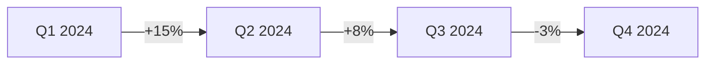

# VitePress Report Generation

Anleitung zur Erstellung von Audit-Reports als VitePress Static Sites mit adesso Branding.

## VitePress Grundlagen

### Projektstruktur

```
reports/<customer-slug>/
├── .vitepress/
│   ├── config.mts          # VitePress Configuration
│   ├── theme/
│   │   ├── index.ts        # Theme Entry
│   │   ├── custom.css      # adesso Branding
│   │   └── components/     # Custom Components
│   └── cache/              # Build Cache (gitignore)
├── public/
│   ├── adesso-logo.svg     # Logo
│   ├── favicon.ico         # Favicon
│   └── og-image.png        # Social Preview
├── index.md                # Landing Page
├── zusammenfassung.md      # Executive Summary
├── analyse/
│   ├── technologie.md      # Tech Stack
│   ├── performance.md      # Performance
│   ├── accessibility.md    # BFSG/A11y
│   ├── seo.md              # SEO
│   └── security.md         # Security
├── empfehlung/
│   ├── cms.md              # CMS-Empfehlung
│   ├── roadmap.md          # Projekt-Roadmap
│   ├── kosten.md           # TCO/Budget
│   └── team.md             # Team-Vorschlag
└── package.json            # Dependencies
```

## adesso Branding

### Farben

```css
:root {
  /* Primary Colors */
  --adesso-blue: #006EC7;
  --adesso-blue-dark: #005299;
  --adesso-blue-light: #4D9FE0;

  /* Secondary Colors */
  --adesso-gray: #887D75;
  --adesso-gray-light: #B3AAA3;
  --adesso-gray-dark: #5C534C;

  /* Accent Colors */
  --adesso-green: #00A651;
  --adesso-red: #E31937;
  --adesso-orange: #F7941D;

  /* Backgrounds */
  --adesso-bg-light: #F5F4F3;
  --adesso-bg-dark: #1A1A1A;

  /* Text */
  --adesso-text: #333333;
  --adesso-text-light: #666666;
}
```

### Typografie

```css
:root {
  /* Fonts */
  --font-primary: 'Fira Sans', -apple-system, BlinkMacSystemFont, sans-serif;
  --font-mono: 'Fira Code', 'JetBrains Mono', monospace;

  /* Sizes */
  --text-xs: 0.75rem;     /* 12px */
  --text-sm: 0.875rem;    /* 14px */
  --text-base: 1rem;      /* 16px */
  --text-lg: 1.125rem;    /* 18px */
  --text-xl: 1.25rem;     /* 20px */
  --text-2xl: 1.5rem;     /* 24px */
  --text-3xl: 1.875rem;   /* 30px */
  --text-4xl: 2.25rem;    /* 36px */
}
```

### Custom CSS (custom.css)

```css
/* adesso VitePress Theme */

/* Override VitePress Colors */
:root {
  --vp-c-brand-1: #006EC7;
  --vp-c-brand-2: #005299;
  --vp-c-brand-3: #4D9FE0;
  --vp-c-brand-soft: rgba(0, 110, 199, 0.14);

  --vp-home-hero-name-color: transparent;
  --vp-home-hero-name-background: linear-gradient(120deg, #006EC7 30%, #4D9FE0);
}

/* Typography */
body {
  font-family: 'Fira Sans', sans-serif;
}

.vp-doc h1, .vp-doc h2, .vp-doc h3 {
  font-weight: 600;
  letter-spacing: -0.02em;
}

/* Score Cards */
.score-card {
  display: flex;
  align-items: center;
  gap: 1rem;
  padding: 1rem;
  border-radius: 8px;
  background: var(--vp-c-bg-soft);
}

.score-card.critical { border-left: 4px solid #E31937; }
.score-card.warning { border-left: 4px solid #F7941D; }
.score-card.success { border-left: 4px solid #00A651; }

/* Tables */
.vp-doc table {
  border-collapse: collapse;
  width: 100%;
}

.vp-doc th {
  background: var(--adesso-blue);
  color: white;
  font-weight: 600;
}

.vp-doc td, .vp-doc th {
  padding: 0.75rem 1rem;
  border: 1px solid var(--vp-c-divider);
}

/* Print Styles */
@media print {
  .VPNav, .VPSidebar, .VPFooter {
    display: none !important;
  }

  .VPContent {
    padding: 0 !important;
  }

  .vp-doc {
    max-width: none !important;
  }
}
```

## VitePress Config

### config.mts

```typescript
import { defineConfig } from 'vitepress'

export default defineConfig({
  title: '[Firmenname] - Website Audit',
  description: 'Umfassende Website-Analyse durch adesso SE',
  lang: 'de-DE',

  head: [
    ['link', { rel: 'icon', href: '/favicon.ico' }],
    ['meta', { property: 'og:image', content: '/og-image.png' }],
    ['link', {
      rel: 'stylesheet',
      href: 'https://fonts.googleapis.com/css2?family=Fira+Sans:wght@400;500;600;700&display=swap'
    }]
  ],

  themeConfig: {
    logo: '/adesso-logo.svg',
    siteTitle: 'Audit Report',

    nav: [
      { text: 'Übersicht', link: '/' },
      { text: 'Analyse', link: '/analyse/technologie' },
      { text: 'Empfehlung', link: '/empfehlung/cms' }
    ],

    sidebar: [
      {
        text: 'Zusammenfassung',
        items: [
          { text: 'Executive Summary', link: '/zusammenfassung' },
          { text: 'Auf einen Blick', link: '/dashboard' }
        ]
      },
      {
        text: 'Analyse',
        items: [
          { text: 'Technologie', link: '/analyse/technologie' },
          { text: 'Performance', link: '/analyse/performance' },
          { text: 'Accessibility', link: '/analyse/accessibility' },
          { text: 'SEO', link: '/analyse/seo' },
          { text: 'Security', link: '/analyse/security' },
          { text: 'Content', link: '/analyse/content' },
          { text: 'UX', link: '/analyse/ux' }
        ]
      },
      {
        text: 'Empfehlung',
        items: [
          { text: 'CMS-Empfehlung', link: '/empfehlung/cms' },
          { text: 'Roadmap', link: '/empfehlung/roadmap' },
          { text: 'Kosten & TCO', link: '/empfehlung/kosten' },
          { text: 'Team', link: '/empfehlung/team' }
        ]
      },
      {
        text: 'Anhang',
        items: [
          { text: 'Technische Details', link: '/anhang/details' },
          { text: 'Lighthouse Reports', link: '/anhang/lighthouse' },
          { text: 'Kontakt', link: '/anhang/kontakt' }
        ]
      }
    ],

    footer: {
      message: 'Erstellt von adesso SE',
      copyright: '© 2025 adesso SE - Solutions for Digital Business'
    },

    search: {
      provider: 'local'
    }
  }
})
```

## Markdown-Konventionen

### Frontmatter

```markdown
---
title: Performance-Analyse
description: Lighthouse-Ergebnisse und Core Web Vitals
outline: [2, 3]
---
```

### Score-Darstellung

```markdown
## Performance Score

<div class="score-card critical">
  <span class="score">45</span>
  <span class="label">Performance Score</span>
  <span class="status">Kritisch</span>
</div>
```

### Tabellen mit Bewertung

```markdown
| Metrik | Wert | Ziel | Status |
|--------|------|------|--------|
| LCP | 4.5s | <2.5s | 🔴 |
| FID | 150ms | <100ms | 🟡 |
| CLS | 0.08 | <0.1 | 🟢 |
```

### Callouts

```markdown
::: tip Empfehlung
Wir empfehlen einen Relaunch mit Drupal 11.
:::

::: warning BFSG-Deadline
Die Frist endet am 28.06.2025!
:::

::: danger Kritisch
Sicherheitslücken gefunden - sofort handeln!
:::
```

### Eingebettete Charts

```markdown
## Traffic-Entwicklung


```

## Build & Deploy

### Build-Kommandos

```bash
# Development
npm run docs:dev

# Production Build
npm run docs:build

# Preview Build
npm run docs:preview
```

### package.json

```json
{
  "name": "@adesso/audit-report-[customer]",
  "version": "1.0.0",
  "scripts": {
    "docs:dev": "vitepress dev",
    "docs:build": "vitepress build",
    "docs:preview": "vitepress preview"
  },
  "devDependencies": {
    "vitepress": "^1.5.0"
  }
}
```

### Netlify Deploy

```toml
# netlify.toml
[build]
  publish = ".vitepress/dist"
  command = "npm run docs:build"

[build.environment]
  NODE_VERSION = "20"

[[redirects]]
  from = "/*"
  to = "/index.html"
  status = 200
```

### GitHub Actions

```yaml
# .github/workflows/deploy.yml
name: Deploy VitePress

on:
  push:
    branches: [main]

jobs:
  deploy:
    runs-on: ubuntu-latest
    steps:
      - uses: actions/checkout@v4
      - uses: actions/setup-node@v4
        with:
          node-version: 20
          cache: npm
      - run: npm ci
      - run: npm run docs:build
      - uses: netlify/actions/cli@master
        with:
          args: deploy --prod --dir=.vitepress/dist
        env:
          NETLIFY_AUTH_TOKEN: ${{ secrets.NETLIFY_AUTH_TOKEN }}
          NETLIFY_SITE_ID: ${{ secrets.NETLIFY_SITE_ID }}
```

## Multi-BD Repository

### Monorepo-Struktur

```
bd-audit-reports/
├── customers/
│   ├── acme-corp/           # BD: Max Mustermann
│   ├── beispiel-gmbh/       # BD: Anna Schmidt
│   └── muster-ag/           # BD: Peter Meyer
├── shared/
│   ├── theme/               # Shared Theme
│   ├── components/          # Shared Components
│   └── assets/              # Shared Assets
├── scripts/
│   ├── new-customer.sh      # Customer Setup
│   └── deploy-all.sh        # Deploy All
└── package.json
```

### Customer Setup Script

```bash
#!/bin/bash
# scripts/new-customer.sh

CUSTOMER_SLUG=$1
BD_NAME=$2

mkdir -p "customers/$CUSTOMER_SLUG"
cp -r shared/template/* "customers/$CUSTOMER_SLUG/"

# Replace placeholders
sed -i "s/{{CUSTOMER}}/$CUSTOMER_SLUG/g" "customers/$CUSTOMER_SLUG/.vitepress/config.mts"
sed -i "s/{{BD_NAME}}/$BD_NAME/g" "customers/$CUSTOMER_SLUG/.vitepress/config.mts"

echo "Created: customers/$CUSTOMER_SLUG"
echo "URL: https://audits.adessocms.de/$CUSTOMER_SLUG"
```

## PDF-Export

### Browser Print

```javascript
// PDF via Browser Print
window.print()
```

### Playwright PDF

```typescript
import { chromium } from 'playwright'

const browser = await chromium.launch()
const page = await browser.newPage()
await page.goto('http://localhost:5173/')
await page.pdf({
  path: 'report.pdf',
  format: 'A4',
  printBackground: true,
  margin: { top: '2cm', right: '2cm', bottom: '2cm', left: '2cm' }
})
await browser.close()
```

## Referenzen

- VitePress Docs: https://vitepress.dev
- Mermaid Diagrams: https://mermaid.js.org
- Markdown-it Plugins: https://github.com/markdown-it
